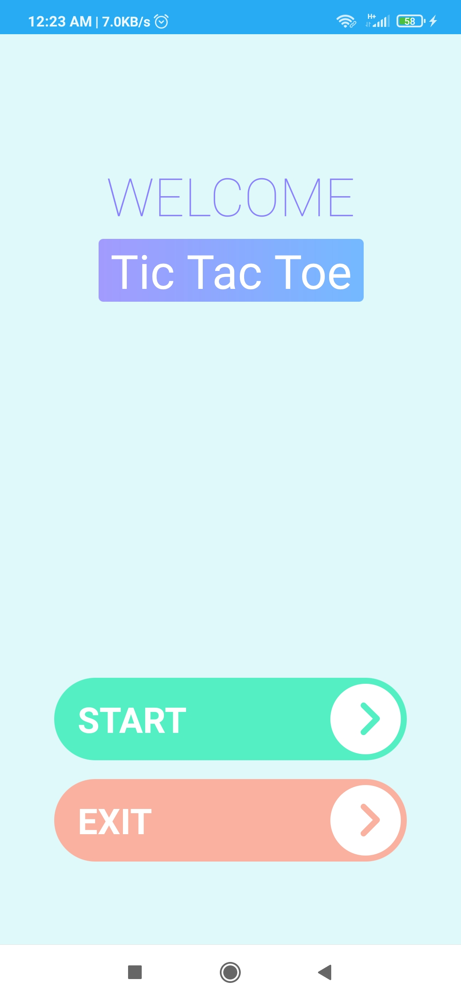
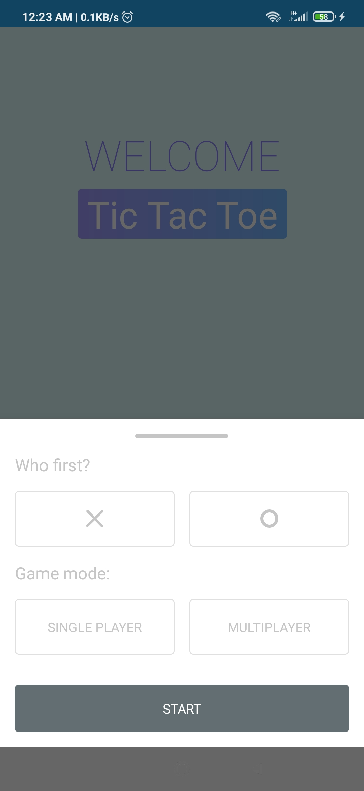
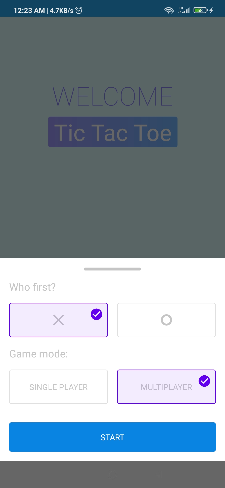
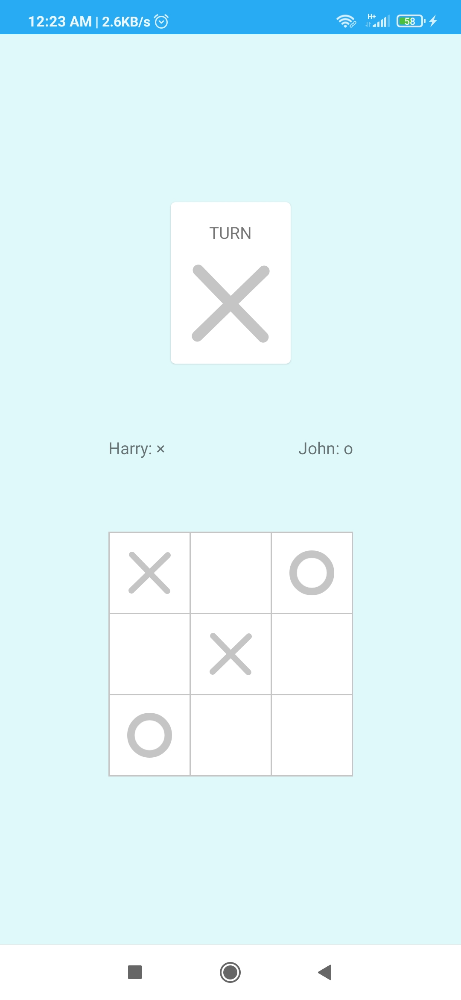
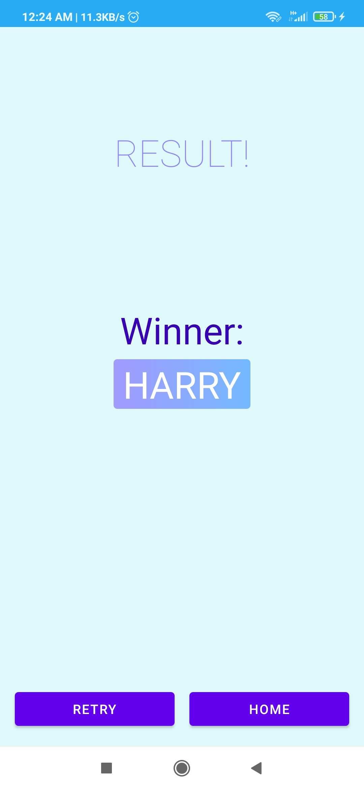
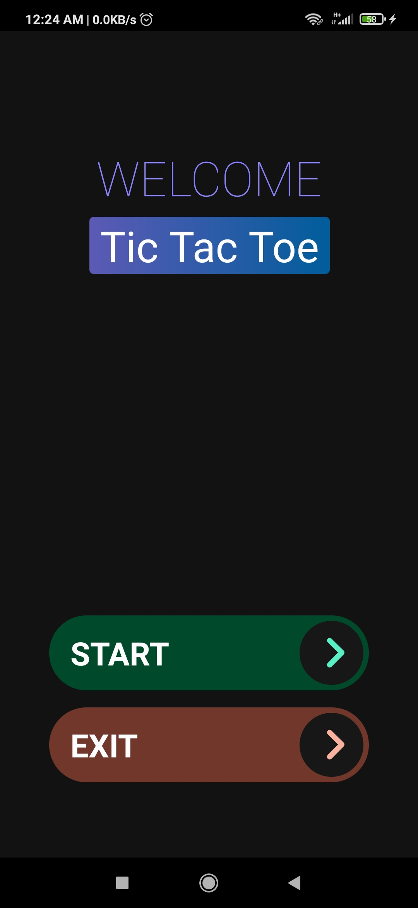

# Tic Tac Toe
Tic Tac Toe is an Android app to play the tic tac toe game. Users can play the game in single-player mode and in multiplayer mode. The app supports Dark Mode.  
Technologies used:

  
  
  
  
  
  

### Screenshots
||||
|---|---|---|
||||
